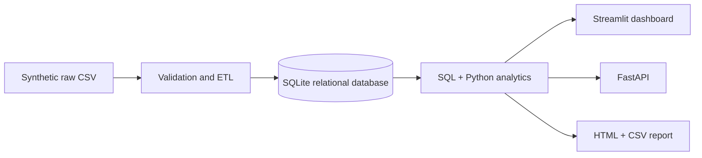

# Business Analytics & Performance Monitoring System

NexaRetail is a portfolio-grade analytics platform for monitoring e-commerce sales, profitability, customers, regions, product performance, and operating risk. It turns a reproducible synthetic source dataset into a validated SQLite warehouse, SQL/Python KPI layer, API, interactive dashboard, and automated executive report.

## Architecture



## Features

- 60k-order seasonal retail dataset with multiple channels, regions, returns, cancellations, duplicate orders, missing values, and invalid quantities.
- Idempotent ETL with transparent data-quality summary and relational constraints.
- Revenue, order, profitability, customer, product, regional, target, trend, and operating KPIs.
- Explainable IQR daily-revenue anomaly detection, data-driven insights, and threshold alerts.
- Six dashboard sections: Executive Overview, Sales, Product, Customer, Regional, Operations.
- FastAPI endpoints: `/health`, `/kpis`, `/sales`, `/products`, `/customers`, `/regions`, `/alerts`, `/insights`.

## Stack

Python, Pandas, NumPy, SQLite (PostgreSQL-ready configuration), SQL, Streamlit, Plotly, FastAPI, pytest.

## Run

```powershell
python -m pip install -r requirements.txt
python data/generate_data.py
python -m pipeline.run_pipeline
streamlit run dashboard/app.py
uvicorn api.main:app --reload
python -m reports.generate_report
pytest
```

SQLite is used by default at `data/nexaretail.db`; generated raw data and reports are intentionally ignored by Git. See `docs/` for metric definitions, schema descriptions, and design notes.

## Business value

The system establishes a repeatable decision workflow: source-quality visibility prevents silent data loss, targets and alerts surface operating risks, and interactive trends reveal the categories/regions responsible for performance changes.
